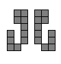
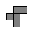
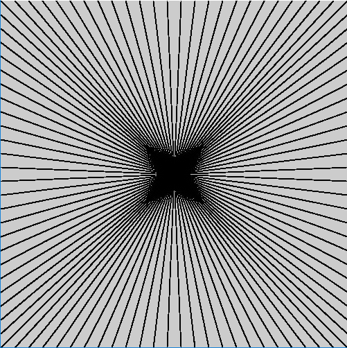

# DT508 Game Programming 2017-2018

Resources
---------
* [Webcourses](http://dit.ie/webcourses) - Course code GAME1003
* [Processing](http://processing.org)
* [The Processing language reference](http://processing.org/reference/)
* [Learning Processing: A Beginner's Guide to Programming Images, Animation, and Interaction (Morgan Kaufmann Series in Computer Graphics)](http://http://www.learningprocessing.com/)
* [The Nature of Code](http://natureofcode.com/)
* [The git manual - read the first three chapters](http://git-scm.com/documentation)
* [A video tutorial all about git/github](https://www.youtube.com/watch?v=p_PGUltnB6w)
* [Games Fleadh](http://www.gamesfleadh.ie/)

## Past Exams
- [Lab Test 1 2016](https://github.com/skooter500/GP_Lab_Test_1)
- [Supplemental lab test 2 2016](https://github.com/skooter500/DT508-Lab-Test-Supplemental-2016)
- [End of year lab test 2016 Solution](https://github.com/skooter500/DT508-Lab-Test-Solution-2016)
- [Lab Test 1 2015](https://github.com/skooter500/dt508_2015_labtest1)

## Contact the lecturer

* Email: bryan.duggan@dit.ie
* Twitter: [@skooter500](http://twitter.com/skooter500)

## Assignments

- 22 November 2017 Lab Test 20%
- 4 December 2017 Assignment 1 submission 20%
- Assignment 2 - 30%
- End of Year lab test - 30%

[Assignment rubric & description](assignments.md)

Some assignments from previous years:

[](https://www.youtube.com/watch?v=TY6Wv9lr72A)

[](https://www.youtube.com/watch?v=cW8s5i9dmqA)

# Semester 2

## Week 5
- [Solution to last weeks lab](processing/classes1)
- [Code we wrote in the class](processing/classes2)
- [ArrayLists](https://processing.org/reference/ArrayList.html)

## Lab
### Learning Outcomes
- Use an ArrayList

In today's lab we will make it possible for the Ship to shoot bullets

- Start with the code we wrote in the class
- Make a class called Bullet that just draws a line like the bullets in this video:

  [](https://www.youtube.com/watch?v=6qzw__ENHlA)
  
- The Bullet class should have fields for x and y, fx and fy, speed and theta. 
- Make a constructor that takes x, y and theta
- Write a render method on the Bullet class. Render should use pushMatrix, transform, rotate and popMatrix
- Write an update method on the Bullet class that moves the bullet in the direction theta
- Create an ArrayList in the sketch to hold the bullet objects called bullets
- In the sketch draw function, iterate over the ArrayList of Bullet's using a for loop. (Not a foreach loop)
- Write code in the Ship class to create new Bullet objects when the player presses the SPACE key. Add the new Bullet objects to the bullets ArrayList
- Give the bullet starting x and y and theta based on the ship x, y and theta. See if you can figure out how to calculate the starting x and y of the bullet so that the bullets spawn *in front* of the ship, regardless of which direction the ship is pointing
- Write code in the Bullet update method to remove bullets from the bullets ArrayList when the bullet goes outside the bounds of the screen

Advanced!

Make asteroids drawn using coloured ellipses that the ship can shoot

## Week 4 - Classes and transforms
- [Classes](https://processing.org/reference/class.html)
- [pushMatrix & popMatrix](https://processing.org/reference/pushMatrix_.html)
- [Code we wrote in the class](processing/classes)

### Lab
- Create classes 
- Use atan2
- make an array of objects

Start with the code we wrote in the class yesterday and make this:

[](https://www.youtube.com/watch?v=1ruS5NAASso)

Start by making a new class called FollowMouseShip. In the constructor, give it a random x and y and random colour. You will have to add a new field to the class to store the colour

Modify the update method. Remove the keyboard handling code and instead, have the ship always move in the direction of it's forward vector. You will have to calculate the theta value using a bit of trigonometry. Check out the atan2 function which you can use to do this. Read the documentation carefully! Now get it so that when the ship gets within 5 units of the mouse position, give it a new random x and y and colour.  

Make a variable of type FollowMouseShip in the sketch and get a single FollowMouseShip working. When you have one ship working, you can create an array of them like in the video

## Week 3 - lerp & map functions
- [lerp](https://processing.org/reference/lerp_.html)
- [map](https://processing.org/reference/map_.html)
- [Code we wrote in the class to use lerp and map in the audio visualiser](processing/audio1)

## Lab

I tried to make a circular spectrum visualiser as a task for today's lab, but unfortunately I couldnt get it to work very well, so instead, how about taking the [little game we made 2 weeks ago](processing/Squares) and combining it with [the visualiser we made in the class this week](processing/audio1). 

You can make the height of the player in the game controllable by whistelling and make the aim of the game to collect or avoid the array of blocks comming in from the right side of the screen. 

## Week 2 - Digital Audio
- [Minim Library Reference](http://code.compartmental.net/tools/minim/)
- [The digital audio sketch we wrote in the class](processing/audio)

## Lab

Use the sketch we wrote in the class yesterday as starter code for todays class. Read through the code and make sure you understand it. You might want to check out the minim documentation to see all the amazing things that you can do with the minim library.

You can get useful information from the audio signal by calculating the maximum and the average of the signal and the frequency spectrum (the fft). 

For example, by calculating the average of the signal, you can get an indication of the average loudness of the audio and then detect silence, claps etc by checking to see if this value is over a certain threshold. Its best to print this number out and figure out what the threshold should be by trial and error.

Dont forget, the elements in the signal array ```ai.left.get(i)``` can be positive or negative, so to calculate the average, you should use ```abs``` to get the absolute value like this:

```Java
average += abs(ai.left.get(i));
```
By calculating the maximum value of the *spectrum* (the fft array), you can figure out the pitch or frequency of the audio. It is often useful to know the index where the maximum value occured rather than the actual value. To convert an index into a frequency, use:

```Java
fft.indexToFreq(maxIndex)
```

Try and make this whistelling controlled ellipse by using the index where the maximum value of the spectrum is to control the y value and the colour of the circle in the sketch:

[](https://www.youtube.com/watch?v=4p0WB5qkzSo)

## Week 1 - Arrays revision
- [Snow example with arrays](processing/snow)
- [The rainfall arrays example](processing/arrays)

# Lab
## Learning outcomes
- Practice using arrays
- Implement a simple collision detection algorithm

Here is a little game you can make today:

[](https://www.youtube.com/watch?v=pDUJC22Zjds)

- [Solution](processing/Squares)

What is happening:

- The little white square is controlled by the player using the W and S keys. The player move outside the bounds of the screen
- The player starts with 5 lives
- The coloured squares appear from the right and move left. When they hit the left side of the screen, they will reappear with a different random y value and colour at the right side of the screen
- If the player hits any of the squares, the player looses a life and the square reappears on the right side of the screen with a new random y value and random colour
- After the player looses all 5 lives, the game is over 

You can add this code to your sketch to implement better keyboard handling:

```Java
boolean[] keys = new boolean[1024];

boolean checkKey(int k)
{
  if (keys.length >= k) 
  {
    return keys[k] || keys[Character.toUpperCase(k)];  
  }
  return false;
}

void keyPressed()
{ 
  keys[keyCode] = true;
}
 
void keyReleased()
{
  keys[keyCode] = false; 
}
```

To check for a key press, use this code:

```Java
if (checkKey('w'))
{
	// do something
}
```


# Week 11 - No class
- [Solution to the lab test](https://github.com/skooter500/GP_Lab_Test_1_2017)


# Week 11 - Completing the Game of Life
- [Game of life code](processing/life1)
- [A more complex implementation that uses colours](https://github.com/skooter500/life)


# Week 10 - The Game of Life
- [Incomplete Game of Life code for the lab today](processing/life1)

- Stephen Hawkings on the Game of Life:

[](https://www.youtube.com/watch?v=CgOcEZinQ2I)

- John Conway on the Game of Life:

[](https://www.youtube.com/watch?v=C2vgICfQawE)

- Epic Conway's Game of Life:

[](https://www.youtube.com/watch?v=FdMzngWchDk)

- And finally, Alan Watts

[](https://www.youtube.com/watch?v=wU0PYcCsL6o)

- [Conway's Game of Life on Wikipedia](https://en.wikipedia.org/wiki/Conway%27s_Game_of_Life)
- [The Game of Life Wiki](http://www.conwaylife.com/wiki/Main_Page)

## Lab
### Learning Outcomes
- Do some work on the Game of Life
- Practice iterating over a 2D array

Try andget the following working:

- Complete the function countLiveCellsAround. You should call this function for some cells on the board. Do a manual count and verify that the function works correctly
- When you press the c key, the board should clear. In otherwords, you should set every element in th 2D array to be false. You can write a function called clearBoard to do this.
- When you press the r key, you should randomise the board again.
- The function ```void mousePressed()``` gets called in your sketch whenever the mouse is pressed. The method ```mouseDragged``` gets called whenever you hold the mouse down and move it over your sketch. You can get the mouse x and y coordinates by using the built in variables ```mouseX``` and ```mouseY```. You can use these methods to implement mouse drawing. To do this you need to calculate which row and column in the 2D array the mouse is over and then set this cell to be true.

There some interesting starting patterns you can program also. You could write code so that when you press a number key it creates the starting pattern at the mouse x and y. I used the mouse x and y to be the top left of the shape.

| Pattern | Description |
|---------|-------------|
| | Gosper Gun |
| | Lightweight spaceship |
| | Tumbler |
| | Glider |
| | I'm not sure what this is called, but it makes amazing patterns |

Here is a video of what my sketch looks like:

[](https://www.youtube.com/watch?v=72X38iT74As)

If you want a challenge, you can try and complete the Game of Life.

# Week 9 - Arrays
- [Arrays reference](https://www.processing.org/reference/Array.html)
- [Arrays example program](processing/arrays)

# Week 8
- Review Week & bank holiday

# Week 7
## Lecture
- [Bugzap](processing/BugZap1)

## Lab
### Learning Outcomes
- Implement a complete simple game project!
- Use if statements, methods and the % operator
- Model a game system in code (scoring, movement, collisions)

Today let's finish programming BugZap. Start with [the code we wrote in the class yesterday](processing/BugZap1). Use your creativity and change colours and shapes of the player and bug.

Here is a video of my version:

[](https://www.youtube.com/watch?v=s6PA8jtWneQ)

- Now add the player lazer. I used to UP key for this. I just drew a line for the lazer.
- Make a variable for score and check for collisions between the lazer and the bug. Add a variable for score. You can print stuff to the screen using the text method in Processing. You can use a PFont to change the font to [this](https://www.dafont.com/hyperspace.font)
- Make some sound effects and add them to the game. I used [BFXR](http://www.bfxr.net/) to make the sounds and the Minim library to play them, but you might prefer to use the [built-in audio methods in Processing](https://processing.org/tutorials/sound/).
- Add the splash screen and game over screen. I used an int variable called gameState to control this.

# Week 6 - No class because of the storm

# Lab
## Learning Outcomes
- Test your knowledge by trying a typical lab test
- Practice using loops, variables and the if statement

Here is a [link to the lab test from 2015](https://github.com/skooter500/dt508_2015_labtest1) you can try and solve it today

# Week 5 - More Loops
- [The solution to the lab from last week](processing/loopsLab)

## Lab
### Learning outcomes
- Practice trigonometry
- Practice writing loops and using variables 

### Part 1
Here is a trigonometry problem for you:

A person flying a kite has released 176m of string. 
The string makes an angle of 27° with the ground. How high is the kite? How far away is the kite horizontally?

You can work this out on paper first and then try and write a Processing sketch to visualise and solve the problem

Also! You can use the processing functions [degrees()](https://processing.org/reference/degrees_.html) and [radians()](https://processing.org/reference/radians_.html) to convert between degrees and radians.

### Part 2

Try and draw this using ONE for loop:


- [Solution](processing/GridInOneLoop)

# Week 4 - Loops


```Java
void setup()
{
  size(500, 500);
  cx = width / 2;
  cy = height / 2;
}

int cx, cy;

void draw()
{
  background(0);
  stroke(255);
  for(int x = 0 ; x <= width ; x += 20)
  {
    line(x, height, cx, cy);
  }
  
  int y = cy;
  int gap = 1;
  while(y <= height)
  {
    line(0, y, width, y);
    y += gap;
    gap += 2;
  }
}
```

- [Lots of examples of loops](processing/lotsaloops)
- [Dividing a circle into equal segments sketch](processing/circles1)

[](https://www.youtube.com/watch?v=h4ApLHe8tbk)
[](https://www.youtube.com/watch?v=RtAPBvz6k0Y)

## Lab
### Learning outcomes
- Practice generating lots of different shapes with loops in processing
- Be creative and make something beautiful in code

Try and write some processing code to draw the following shapes. Use variables and loops in your solutions!

Its best to spend some time thinking about the variables and how they are changing before writing code:

These require ONE loop:


This shape draws lines from the sides that all meet in the middle. This can be done using one loop, but is better with two:



This sketch always draws 10 equally sized circles across the screen. This should work no matter what you set the screen size to. You should also declare a variable to hold the number of circles to draw so that if you change this number, the sketch should still work:


This sketch places circles around the outside of a bigger circle to make a flower pattern. Once you figure this out, you can modify it to do something cool with colours:


This sketch prints the numbers of the clock around in a circle:


Finally! This sketch requires you to put one loop inside another and also use a boolean variable, though there are other ways to do this:


This is what it looks like when all the above code is in one sketch:


# Week 3 - Selection
- [The quadrants sketch](processing/quadrants)
- [Mouse inside a circle sketch](processing/circleDistance)

## Videos
[](https://www.youtube.com/watch?v=mVq7Ms01RjA)

[](https://www.youtube.com/watch?v=wsI6N9hfW7E)

[](https://www.youtube.com/watch?v=YIKRXl3wH8Y)

## Lab

Part 1

- [Download and unzip the starter project for today's lab](https://github.com/skooter500/GP-2017-2018/blob/master/downloads/rick_n_morty_starter.zip?raw=true) 
- Open the sketch and you will see that it displays a picture from Rick and Morty
- The aim of the lab today is to modify the sketch so that it displays a button in the center of the screen
- When the button is clicked, it should change colour and play the sound file. Here is what the finsihed sketch should look like:

[](https://www.youtube.com/watch?v=BR1p2Dl6ELE)

- To do this you will need to declare some new varialbes and use the if statement

Part 2

Try and make this sketch that draws a face that starts in the center of the screen and moves to the edge of the screen and then follows around the outside of the screen

[](https://www.youtube.com/watch?v=lA-3AROmMiE)


# Week 2 - Variables
- [Variables example](processing/variables)
- [The amanita sketch (the mushroom that moves with the mouse)](processing/amanita)

## Videos
[](https://www.youtube.com/watch?v=B-ycSR3ntik)

[](https://www.youtube.com/watch?v=rZ36BzXFT6Q)

## Lab

### Learning Outcomes
- Learn how to analyse a problem and figure out a solution
- Practice drawing in processing
- Practice using variables
- Practice using operations

Here is a video of a sketch you can make today:

[](https://www.youtube.com/watch?v=uvPVGiU-bn4)

What is happening:

- The ground takes up half the window size
- The spaceship is 100 pixels wide and is *centered* around the mouse position.
- The person starts at the right side of the screen and moved from right to left

Use variables wherever practical in your sketch and calculate positions and sizes relative to these variables.

Bonus!

There are few things you can try (but you will probably have to read ahead and figure out how the if statement works)

- Come up with a more beautiful looking spaceship and person
- Change the colours of everything
- Make a car that drives from left to right
- When the person reaches the left side of the screen, he should switch direction
- Make the lights on the spaceship flash different colours

# Week 1 - Introduction

## Lecture
- [Introduction slides](https://1drv.ms/p/s!Ak7y2552PWCrkMw2-mb76OvGqWk6NQ)
- [The contract for this course](https://1drv.ms/w/s!Ak7y2552PWCrjPYXt8HlWl1T1cg5Og)

## Lab

### Learning Outcomes
- Enroll on Webcourses
- Become familiar with the syntax of Processing
- Become familiar with writing and running sketches in Processing
- Clone a git repository!
- Install Processing libraries

### Part 1 - Drawing
- Log onto Webcourses and enroll on the module GAME1003.
- Check out [the Processing reference](https://processing.org/reference/)
- Check out [Daniel Shiffman's awesome YouTube channel](https://www.youtube.com/user/shiffman)
- Check out [these Sci-Fi user interfaces made by last years OOP students](https://www.youtube.com/playlist?list=PL1n0B6z4e_E5RZYrubD2pcxq0qzGy-3vr)
- Check out [these music visualisers made in Processing by last years game programming students](https://www.youtube.com/watch?v=cW8s5i9dmqA&list=PL1n0B6z4e_E6jErrS0ScSCaVrN7KV729x)
- If you are curious, check out [some of my creature videos](https://www.youtube.com/watch?v=cW8s5i9dmqA&list=PL1n0B6z4e_E6jErrS0ScSCaVrN7KV729x)

- Look up the following methods in the [Processing language reference](http://processing.org/reference/ ) to make sure you are clear about the syntax and parameters:

* noStroke
* noFill
* line
* ellipse
* rect
* background
* stroke
* fill
* size
* arc
* triangle

Write a processing sketch to draw the following shapes:


I prefer to draw the shapes on paper first before I try and work out the coordinates. Try experimenting with different colours!

### Part 2 - Downloading a Processing game

- Download the Processing sourcecode for NILL. Click the [clone or download link here](https://github.com/skooter500/NILL)
- This will download a zip file of the code for the NILL game
- Unzip the files somewhere 
- Find the NILL folder and double click on the NILL.pde file. It should open in Processing
- You need to install the Minim library and the Game control libraries to make NILL work. Go to Sketch | Import Library | Add library to do this
- See if you can collect all the pods
- Have a look through the source code for NILL
